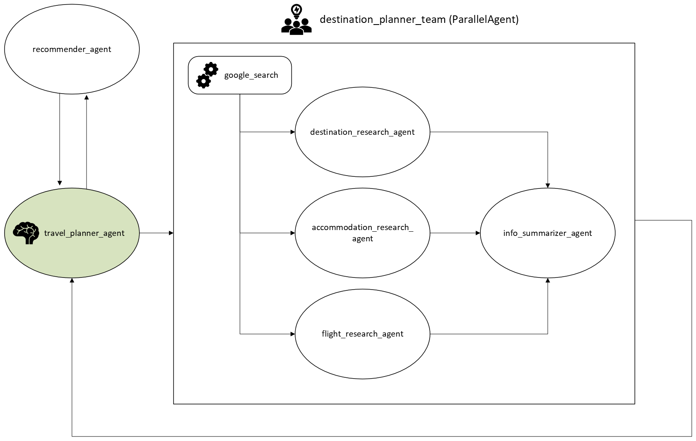

# Project Overview - Happy Travel Agent
This project contains the core logic for the Happy Travel Agent, the multi-system concierge agent for finding and planning a complete travel itinerary upcoming holidays. The agent is built by using Google Agent Development Kits (ADK).

## Problem Statement
Unarguably, when it comes to travel, the most boring part for travellers is planning the travel itinerary. Making a travel plan is a repetitive process for every trip, which involves a lot of time-consuming research on the activities, the popular attractions, the accommodations, and the flights. Usually, travellers need to explore each aspect separately before being able to combine them altogether as a single plan, as the information is often scattered across the internet. For example, the attractions and activities are normally available on travel blogging websites, but the flights and accommodations mostly come from booking sites. However, the combination is still not the end of the planning process. The process will still go on with the refinement process, involving endless adjustment and change of items in the plan to satisfy many limitations of each travel group. Therefore, if there is an autonomous platform to help travellers research and initiate the travel itinerary, then travellers will be able to focus mainly on the refinement process and be able to finalise the itinerary faster.

## Solution Statement
The agent can promptly assist users by completing the list of tasks to create the full travel itinerary for them. The task of the agent starts from the first moment the user realises their need to travel. Without having a clear travel destination in mind, the user can consult with the agent by providing basic information (such as their expected travel date with a duration, their expectation, and their country of origin). Then, the agent will provide them with a list of high-potential destinations, which can be revised according to the user's feedback.  Once the user has confirmed the destination, the agent will find all the information required for making an itinerary (such as the flight information, the local attractions, and the accommodations). Finally, the agent will find the optimal choices and compile the information into a simple day-to-day travel plan for the user to conveniently follow. 

## Architecture

### `travel_planner_agent`
The `travel_planner_agent` serves as the central orchestrator of the system. It receives the user’s query and processes it according to its predefined instruction. Its first responsibility is to interpret the user’s situation and requirements while ensuring that sufficient information has been provided. If the user has not yet selected a destination, the agent delegates to the `recommender_agent`, which generates a list of suitable destinations based on the user’s preferences. Once the user has chosen a destination—or once the agent has inferred the user’s preference—the `travel_planner_agent` then assigns the task to the `destination_planner_team` to gather and summarise all essential information needed for planning the trip. Finally, it evaluates the collected details, assembles the complete travel itinerary, and returns the final plan to the user.
### `recommender_agent`
The `recommender_agent` specialises in generating travel destination suggestions based on the user’s specific preferences and conditions. It is activated only when the `travel_planner_agent` identifies that the user does not yet have a preferred destination. Once delegated, the `recommender_agent` uses the `google_search` tool to explore relevant destinations and compiles the results into a shortlist of the five most suitable options, each accompanied by a brief description. This curated list is then returned to the `travel_planner_agent`.
### `destination_planner_team`
The `destination_planner_team` is a group of specialised sub-agents responsible for researching the three core components of a travel itinerary: flights, attractions and restaurants, and accommodations. This work is carried out by three dedicated agents—`flight_research_agent`, `accommodation_research_agent`, and `destination_research_agent`—each using the `google_search` tool to gather information relevant to its assigned domain. To ensure both quality and efficiency, these sub-agents operate as `ParallelAgent` instances, allowing their research tasks to run simultaneously. Once all research is complete, the results are passed to the info_summarizer_agent, which consolidates the findings into a structured list and returns it to the `travel_planner_agent` for further processing.

## Value Statement
I have created Happy Travel Agent to plan my family's Christmas vacation and the next summer vacation, as I am currently busy with work on many year-end projects. Usually, I spend around 3 hours exploring many different travel destinations alongside their sample travel itineraries on various travel blogs, searching for available accommodations with decent reviews, and finding options for flights before I can summarise the information into my travel itinerary. Then, there are always some adjustments needed, so I will need to repeat some of the research and summarise processes. Roughly, it takes me around 10 hours to create the final version of a travel itinerary with everyone's consensus.

However, with the Happy Travel Agent, I could reduce the time taken to approximately 1-2 hours, because the agent had already created the first draft of the itinerary for my family and me to review. With a few additional adjustments, the travel itinerary is already finalised and ready to be booked.

In the future, it would be even more convenient if I could upgrade the Happy Travel Agent to be able to manage the booking part by itself. To do this, I need to learn more on the topics of AP2, MCP, and HITL architecture.

# Installation
This project was built against Python 3.13.2
It is suggested to create a Python virtual environment before running the code.

# Project Structure
The project structure is as follows:
* `travel_planner_agent/`: The main package
  * `agent.py`: Define the main agent, `travel_planner_agent`
  * `config.py`: Define helper functions, `agentConfig` and `retryConfig`
  * `sub_agents/`: Define all sub-agents, each for a specific task
    * `accommodation_research_agent`: Responsible for finding accommodations
    * `destination_research_agent` : Responsible for finding attractions, activities, and restaurants
    * `flight_research_agent` : Responsible for finding flights
    * `info_summarizer_agent` : Responsible for summarizing findings from `accommodation_research_agent`, `destination_research_agent` ,and `flight_research_agent`
    * `recommender_agent` : Responsible for finding suitable destinations
* `tests/`: Contain a running test for the agent

# Workflow
The workflow is as follows:
 1. **UNDERSTAND**: You will carefully read and understand the user's situation. If not provided, you will ask for the information on the travel dates, the country of origin, and the destination. If the user already has a destination in mind, you will proceed to STEP 3. If not, you will proceed to STEP 2

 2. **RECOMMEND DESTINATIONS**: You will use the 'recommender_agent' sub-agent to provide a list of top 5 recommended travel destinations based on the user's preferences and constraints (such as travel dates, season, budget, interests, etc.). You will present these recommendations to the user and ask them to choose one destination from the list. If the user does not like any of the recommendations, you will ask them for more details about their preferences and constraints, and then provide a new list of recommendations using the 'recommender_agent' sub-agent. Once the user has chosen a destination, you will proceed to STEP 3.

3. **RESEARCH DESTINATION**: You will use the 'destination_planner_team' sub-agent team to research detailed information about the chosen travel destination, including attractions, cuisine, accommodation options, and flight options.

4. **SUMMARIZE & PLAN ITINERARY**: You will create a comprehensive and detailed day-to-day travel itinerary for the user's trip to the specified destination
